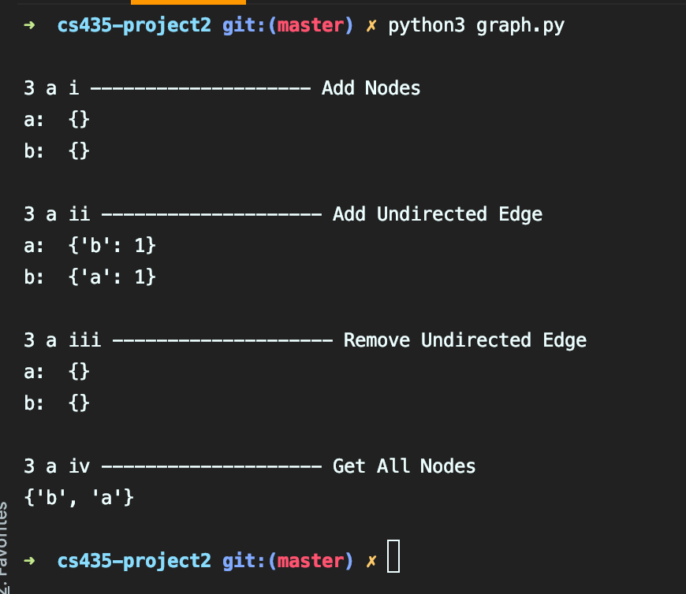
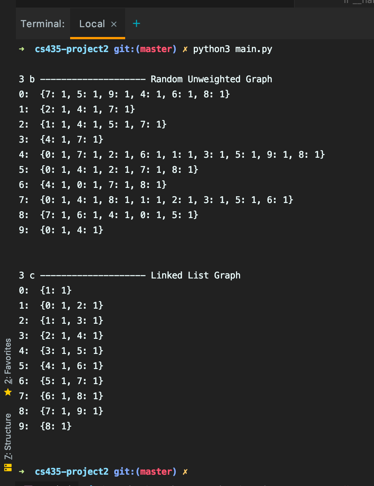
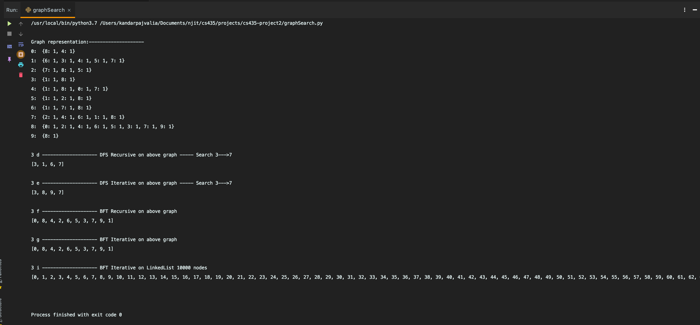
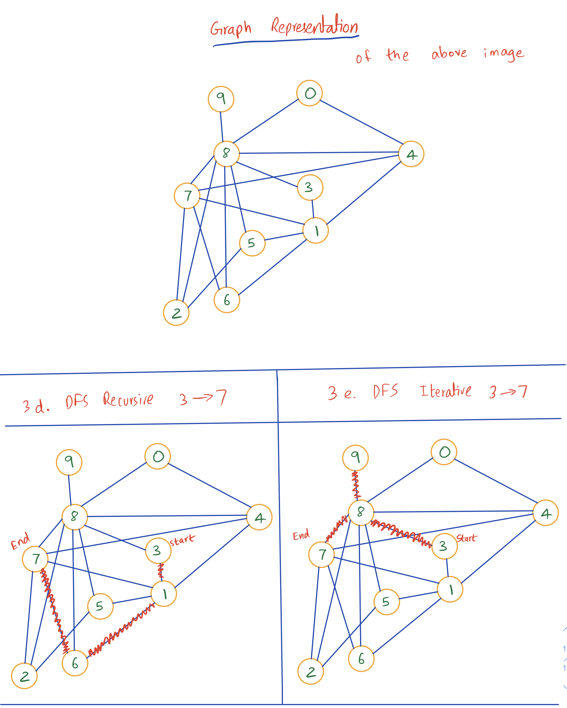
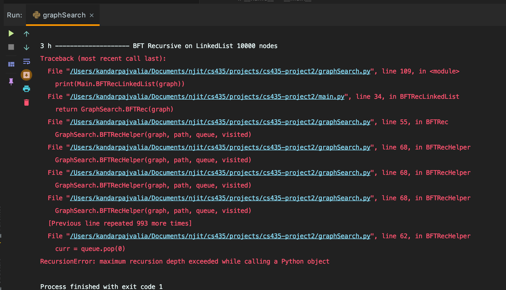
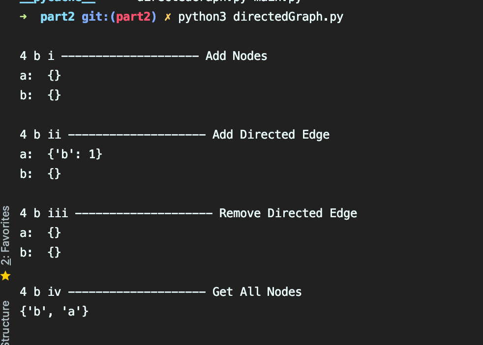
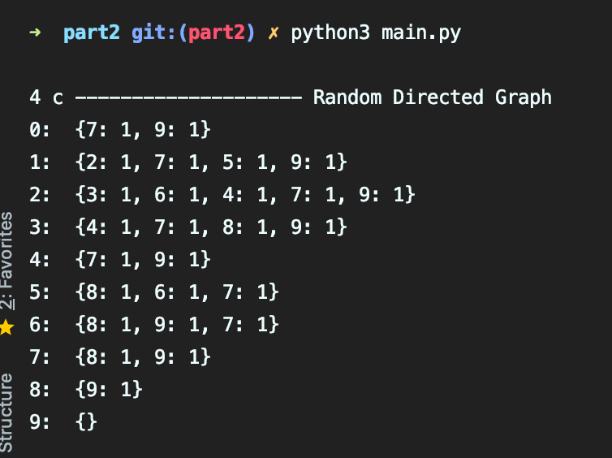
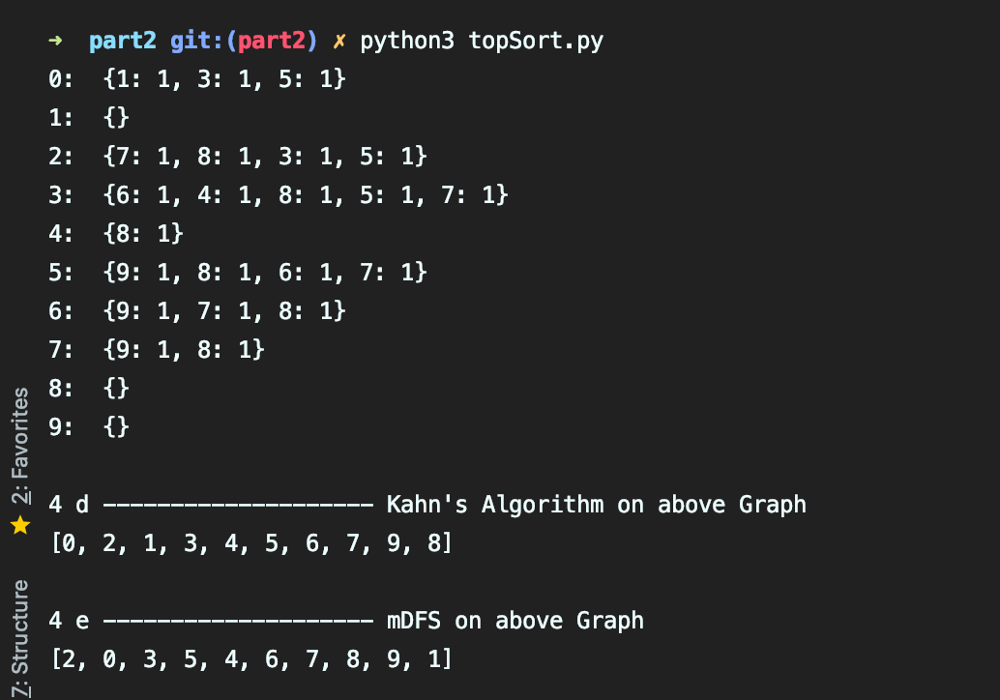
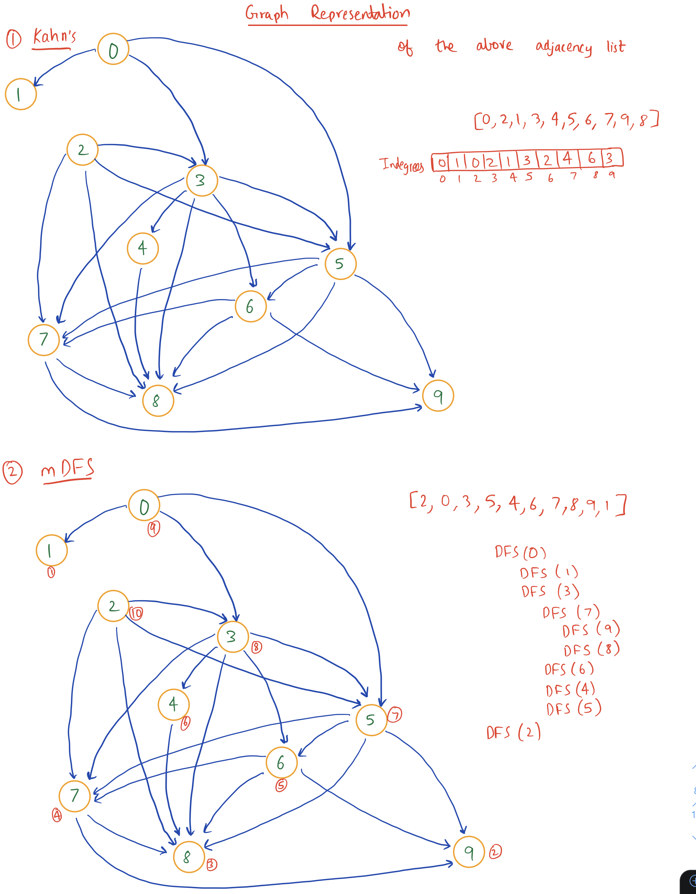

<h1>CS 435 Project 2: Graphs</h1>

  <h3>Project Instructions</h3>
  <h5>Using <code>#!/bin/python3</code></h5>
  <ul>
    <li>Code for each question resides inside its class file.</li>
    <li>Testing code for each class resides at the end of the respective class file.</li>
  </ul>
  <h4>Part 1:</h4>
  <ol>
    <li>3 a:  Run using <code>python3 graph.py</code> 
        

        
       
 
    </li>
    <li>3 b, 3c:  Run using <code>python3 main.py</code> 
        

        
       
 
    </li>
    <li>3 d to 3i, except 3h:  Run using <code>python3 graphSearch.py</code> 
        

        
       

       
Graph Representation and tracing paths:

       

        
       

    </li>
    <li>3 h:  Uncomment the recursive call lines in 
        <a href="https://github.com/KandarpAjvalia/cs435-project2/blob/master/part1/graphSearch.py">graphSearch.py</a> 
         Run using <code>python3 graphSearch.py</code> 
        

        
       
 
    </li>
  </ol>
  <h4>Part 2:</h4>
  <ol>
    <li>4 b:  Run using <code>python3 directedGraph.py</code> 
       

        
       
 
    </li>
    <li>4 c:  Run using <code>python3 main.py</code> 
       

        
       
 
    </li>
    <li>4 d and e:  Run using <code>python3 topSort.py</code> 
       

        
       
 
       
Graph Representation and Topological sort algorithms:

       

        
       
 
    </li>
  </ol>

