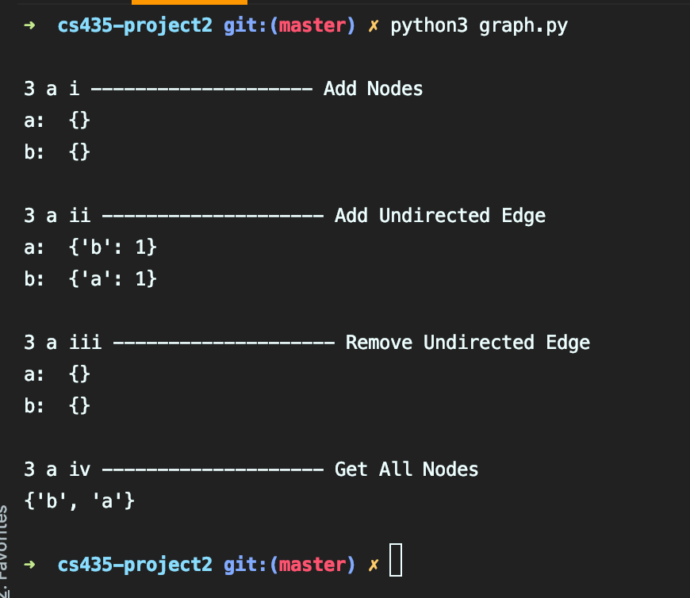

<h1>CS 435 Project 2: Graphs</h1>

  <h3>Project Instructions</h3>
  <h5>Using <code>#!/bin/python3</code></h5>
  <ul>
    <li>Code for each question resides inside its class file.</li>
    <li>Testing code for each class resides at the end of the respective class file.</li>
  </ul>
  <h4>Part 1:</h4>
  <ol>
    <li>3 a: Run using <code>python3 graph.py</code> 
        

        
       

    </li>
  </ol>

